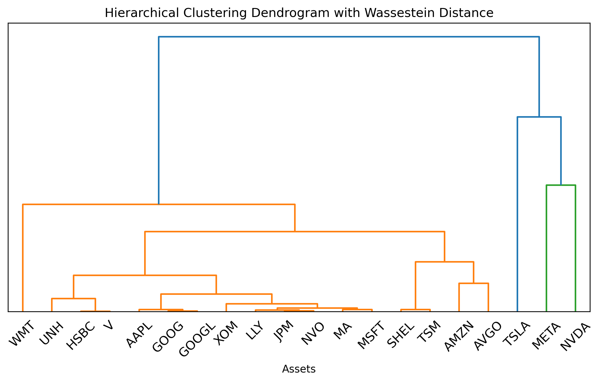

# Hierarchy Risk Parity with Sliced Wasserstein Distance
## Files
* `main.py` : Main script to run results.
* `finance_data_utils.py` : Simple tools for financial data.
* `hierarchy.py` : Hierarchy clustering tools.
* `wasserstein.py` : Functions for calculating the Wasserstein Distance.
* `./data` : Fundemental data files.
* `./results` : Saved results including performances and figures.
  
## Overview
This trial explores enhancing HRP portfolio optimization by using sliced-Wasserstein distance for clustering. Results are preliminary and may not outperform the original method, but further research could improve outcomes.

## Data
* Time Period: 2014.01.01 - 2024.05.01
* Stocks:  Top 20 market cap stocks in the US and Taiwan stock market.
* Rebalance Frequency: 12 months

## Methodology
### Hierarchy Risk Parity
* Base line model for this asset allocation expieriment.
* Cluster based only on closed price data.
  
### Approximate Sliced Wassestein Distance
* A method that speeds up the calculation of Wasserstein Distance.
* Substitute the distance measure in the hierarchy clustering frame-
work with Wasserstein distance measure.

## Cluster Results
### Cluster with Euclidean Distance

### Cluster with Wasserstein Distance

## Backtest Results
### Taiwan Market 24 Month rolling window 

### Taiwan Market 60 Month rolling window 

### Us Market 24 Month rolling window 

### Us Market 60 Month rolling window 

